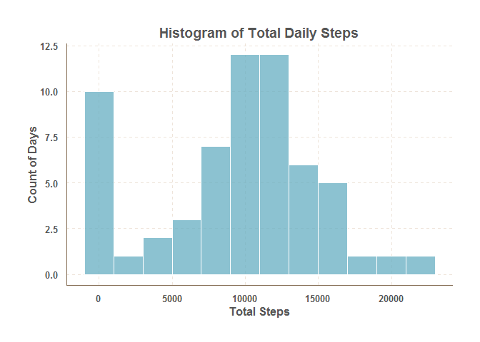
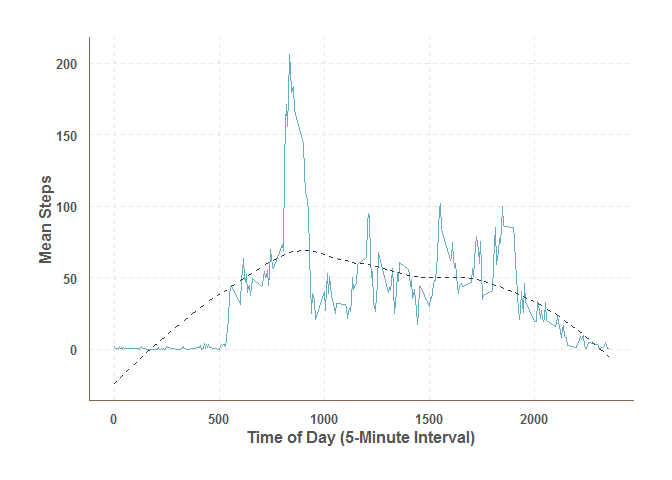
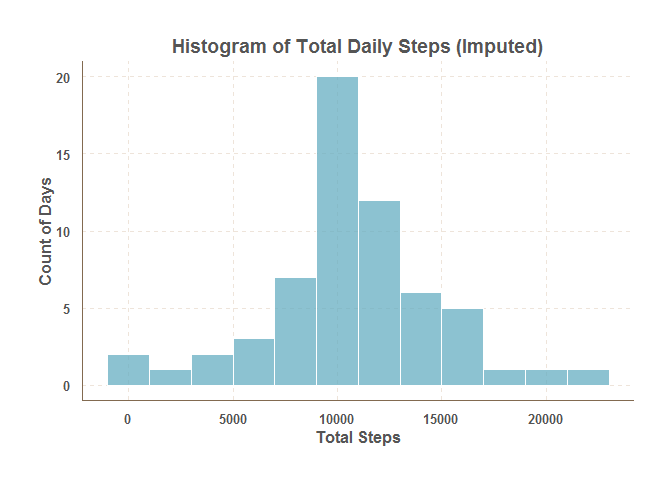
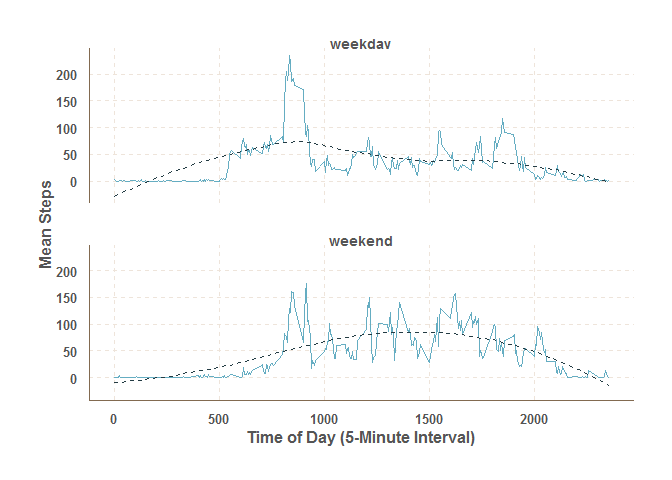

# Reproducible Research: Peer Assessment 1

In _Peer Assessment 1_, we will make use of the following packages:


```r
library(dplyr)
```

```
## 
## Attaching package: 'dplyr'
```

```
## The following objects are masked from 'package:stats':
## 
##     filter, lag
```

```
## The following objects are masked from 'package:base':
## 
##     intersect, setdiff, setequal, union
```

```r
library(tidyr)
library(data.table)
```

```
## 
## Attaching package: 'data.table'
```

```
## The following objects are masked from 'package:dplyr':
## 
##     between, last
```

```r
library(ggplot2)
library(ggthemr)
library(knitr)
```


## Loading and preprocessing the data

We begin the data loading and preprocessing section by verifying the existence of the activity.zip file within the directory.  The zip file is extracted if activity.csv is not already in the directory.


```r
## Check if data is available.  Download and unzip if it is not.
fname <- "activity.csv"
zipname <- "activity.zip"
zipurl <- "https://d396qusza40orc.cloudfront.net/repdata%2Fdata%2Factivity.zip"

if(!file.exists(fname))
{
        if(!file.exists(zipname))  
        {
                download.file(zipurl,zipname)
        }
        unzip(zipname)
}
```

Now we load the data using `fread()`.


```r
activity <- fread("activity.csv")
```


## What is mean total number of steps taken per day?

We begin by using the summarize and group by facilities of the `dplyr` package to calculate daily totals:


```r
activity.total <- activity %>%
                  group_by(date) %>%
                  summarize(total.steps=sum(steps,na.rm=TRUE)) 
```

Next we plot the histogram of daily totals using `gplot2`.  The `ggthemr` package is used to make a graph with a nicely designed palette:


```r
ggthemr('fresh')

activity.total %>% ggplot() +
                  geom_histogram(aes(total.steps), 
                                 binwidth = 2000,
                                 alpha=0.75,
                                 color=ggthemr:::get_themr()$palette$background) +
                  ggtitle("Histogram of Total Daily Steps") +
                  xlab("Total Steps") +
                  ylab("Count of Days")
```

<!-- -->

We again use the `dplyr` package to find the mean and median steps per day--note that we ungroup prior to summarizing.


```r
activity.mean <- activity.total %>%
                  ungroup() %>%
                  summarize(mean.steps=round(mean(total.steps),digits=2),
                            median.steps=median(total.steps))
```

We find that the mean total number of steps per day is 9354.23 and the median is 10395.

## What is the average daily activity pattern?

We begin by calculating averages by `interval`.


```r
activity.pattern <- activity %>%
                  group_by(interval) %>%
                  summarize(mean.steps=mean(steps,na.rm=TRUE)) 
```

We now utilize the `ggplot2` to graph the series:


```r
swtch <- ggthemr:::get_themr()$palette$swatch

activity.pattern %>% ggplot(aes(x=interval, 
                                     y=mean.steps)) +
                              geom_line() +
                              xlab("Time of Day (5-Minute Interval)") +
                              ylab("Mean Steps") +
                              geom_smooth(size=.5,
                                          linetype=2, 
                                          se=FALSE) +
                              no_legend()
```

<!-- -->

Analysis of the graph suggests that average step activity is effectively `0` between the hours of `12 am` and `4 am`.  Activity increases to a rough peak in the `8-9 am` hour and lower localized peaks around `12 pm`, `4 pm`, and `7 pm`.  Activity then decreases through the evening and night.   

**Peak average step activity of `206` steps occurs in the `8:35 am` interval.**


## Imputing missing values

THe assignment reccommends a simple method, such as mean or median value imputation be used.  In particular both per-day and per-interval measures are suggested.  A quick examination of the main `activity` reveals that daily will not work:


```r
# Table of activity:
kable(head(activity),format="markdown")
```


| steps|date       | interval|
|-----:|:----------|--------:|
|    NA|2012-10-01 |        0|
|    NA|2012-10-01 |        5|
|    NA|2012-10-01 |       10|
|    NA|2012-10-01 |       15|
|    NA|2012-10-01 |       20|
|    NA|2012-10-01 |       25|

```r
# All values are missing!
sum(!is.na(activity[date=="2012-10-01"]$steps))
```

```
## [1] 0
```

Given the above, we have elected to use a per-interval measure for our imputation. We utilize `dplyr` to remove the `NA` records from activity, then join them with the means calculated from the daily pattern identified in the last segment using an `inner join`.  THese are then matched back against `activity` using a `row bind`. 


```r
activity.full <- activity %>%
                  filter(!is.na(steps))

activity.imputed <- activity %>% 
                  filter(is.na(steps)) %>%
                  select(date,interval) %>%
                  inner_join(activity.pattern,by="interval") %>%
                  rename(steps=mean.steps) %>%
                  select(steps,date,interval) %>%
                  bind_rows(activity.full) %>%
                  arrange(date,interval)
```

We now proceed to reproduce the histogram, mean, and median:


```r
ggthemr('fresh')
activity.imputed.tot <- activity.imputed %>% 
                        group_by(date) %>%
                        summarize(total.steps=sum(steps,na.rm=TRUE))
      
      
activity.imputed.tot %>%ggplot() +
                        geom_histogram(aes(total.steps), 
                                       binwidth = 2000,
                                       alpha=0.75,
                                       color="white") +
                        ggtitle("Histogram of Total Daily Steps (Imputed)") +
                        xlab("Total Steps") +
                        ylab("Count of Days")
```

<!-- -->

We again use the `dplyr` package to find the mean and median steps per day--note that we ungroup prior to summarizing.


```r
activity.imputed.mn <- activity.imputed.tot %>%
                        ungroup() %>%
                        summarize(mean.steps.imputed=mean(total.steps),
                                  median.steps.imputed=median(total.steps)) %>%
                        bind_cols(activity.mean) %>%
                        mutate(mean.diff=mean.steps.imputed-mean.steps,
                               median.diff=median.steps-median.steps.imputed) %>%
                        select(mean.steps,
                               mean.steps.imputed,
                               mean.diff,
                               median.steps,
                               median.steps.imputed,
                               median.diff) 
                        
kable(activity.imputed.mn,format="markdown")
```


| mean.steps| mean.steps.imputed| mean.diff| median.steps| median.steps.imputed| median.diff|
|----------:|------------------:|---------:|------------:|--------------------:|-----------:|
|    9354.23|           10766.19|  1411.959|        10395|             10766.19|   -371.1887|

We can see that the mean value changed by 1411.9586792 and the median changed by -371.1886792 due to the imputation process.


## Are there differences in activity patterns between weekdays and weekends?

First we use `weekdays()` to identify which dates are Saturdays or Sundays.


```r
activity.wknd<- activity %>%
                  mutate(wkdy=weekdays(as.Date(date))) 

activity.wknd[wkdy %in% c("Saturday","Sunday")]$wkdy <- "weekend"
activity.wknd[wkdy != "weekend"]$wkdy <- "weekday"
```

We use `dplyr` to calculate the patterns.


```r
activity.pattern.wknd <- activity.wknd %>%
                  group_by(interval,wkdy) %>%
                  summarize(mean.steps=mean(steps,na.rm=TRUE)) 
```

We now utilize `ggplot2` to plot a panel comparison of the two patterns.


```r
activity.pattern.wknd %>% ggplot(aes(x=interval, 
                                     y=mean.steps)) +
                              facet_wrap(~wkdy,
                                         nrow = 2,
                                         ncol = 1) +
                              geom_line() +
                              xlab("Time of Day (5-Minute Interval)") +
                              ylab("Mean Steps") +
                              geom_smooth(size=.5,
                                          linetype=2, 
                                          se=FALSE) +
                              no_legend()
```

<!-- -->

We can see from above, that activity shifts on the weekend. There is higher activity in the afternoon-to-early-evening when compared to weekdays.  The weekdays tend to have an early-morning peak, which is not reached on the weekends.  THis could be due to concentrated pre-work exercise occuring during the week, while the weekend offers more freedom in terms of time available for activity.
